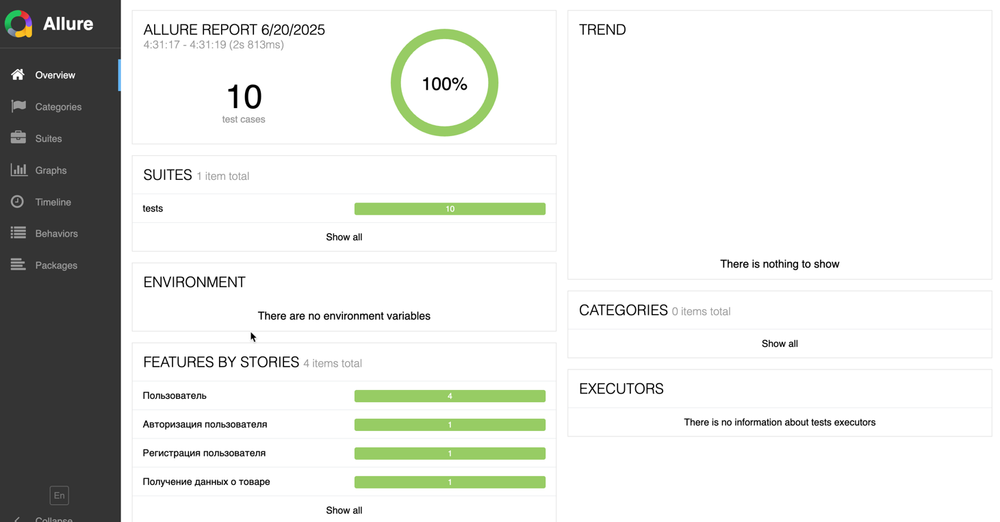
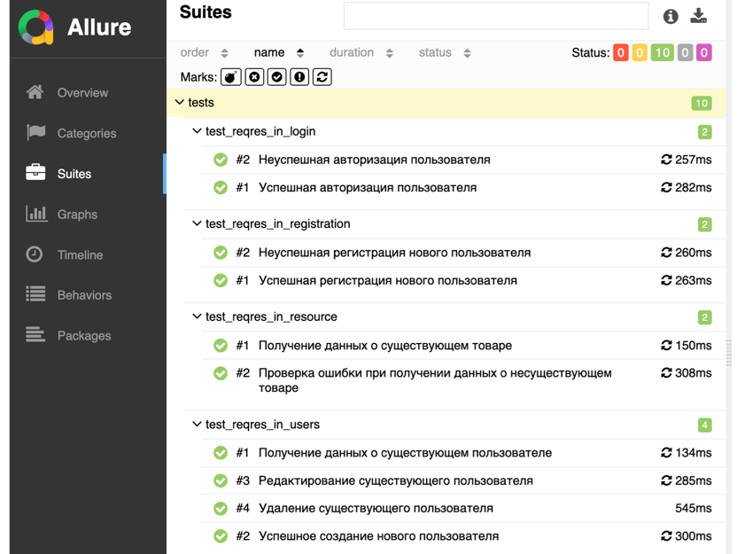

# Дипломный проект QA.GURU (API-тестирование)

Данный репозиторий содержит проект - API тестирование для https://reqres.in/api - часть дипломной работы, выполненной в рамках обучения на курсах QA.GURU. Проект разработан с целью продемонстрировать полученные навыки и знания в области тестирования программного обеспечения.

## Используемые инструменты
<div>
&nbsp
&nbsp
&nbsp
&nbsp
 
&nbsp
&nbsp
</div>

## Список автоматизированных тест-кейсов:
1. Проверка успешной регистрации нового пользователя
2. Проверка ошибки при неуспешной регистрации пользователя
3. Проверка успешной авторизации
4. Проверка неуспешной авторизации
5. Проверка получения данных о существующем пользователе
6. Проверка редактирования данных существующего пользователя
7. Проверка удаления существующего пользователя
8. Проверка создания нового пользователя
9. Проверка получения данных о существующем товаре
10. Проверка ошибки при запросе данных о несуществующем товаре

## Запуск тестов и получение отчета

### **Локально**

<details><summary>1. Склонировать репозиторий</summary>

```
git clone https://github.com/SychkovArkadiyQA/QA_GURU_Python_19_api_diplom
```
</details>

<details><summary>2. Установить зависимости и запустить тесты</summary>

```
python -m venv .venv
source .venv/bin/activate
pip install poetry
poetry install
pytest .
```
</details>

<details><summary>3. Получить отчет о прохождении тестов в allure</summary>

```
allure serve tests/allure-results/
```
</details>

<details><summary>4. После выполнения команды откроется браузер с отчетом</summary>
    


</details>

### **Удалённо**

Удаленный запуск автотестов осуществляется при помощи Jenkins. Для этого необходимо выполнить следующие действия:

1. Открыть проект на Jenkins

<details><summary>2. Нажать на Build now</summary>


</details>

<details><summary>3. Дождаться окончания выполнения автотестов и нажать на иконку allure для просмотра отчета</summary>


</details>

## Отчет в Allure report

<details><summary>Основной отчет</summary>



</details>
<details><summary>Тесты</summary>



</details>

##  Отчет в <a href = "https://allure.autotests.cloud/project/4367/dashboards">Allure TestOps</a>

<details><summary>Основной отчет</summary>


</details>

<details><summary>Тесты</summary>


</details>

